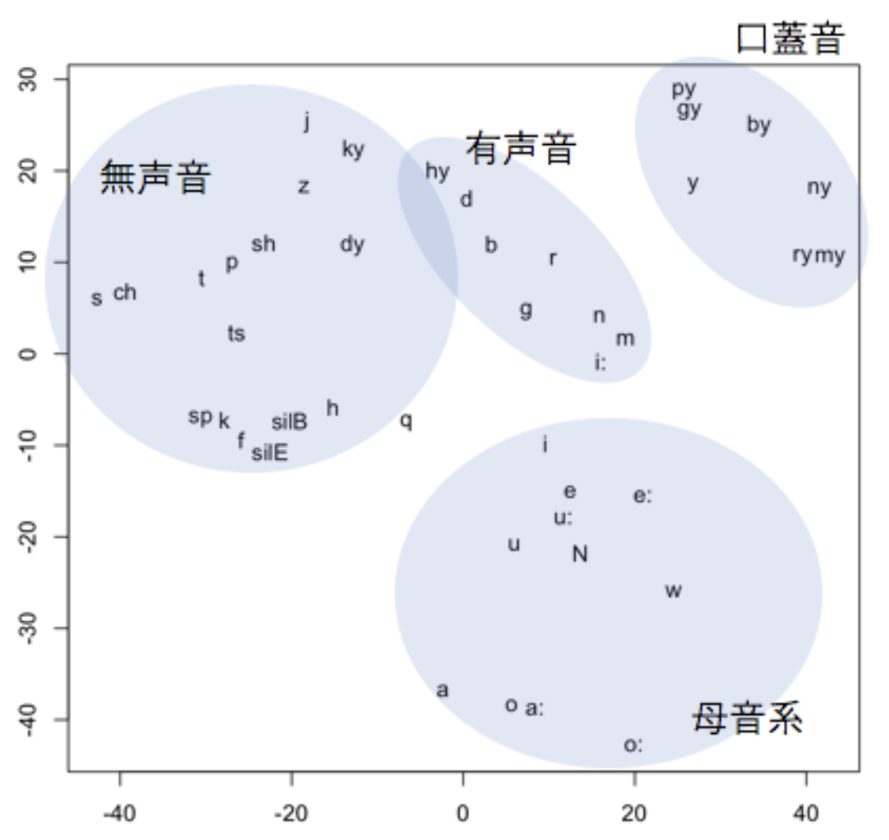

# kanasim

このリポジトリは、空耳歌詞の作詞支援アプリ「[Soramimic](https://soramimic.com)」で使用されている、日本語のカナの音韻類似度データと、そのデータを用いて単語間の類似度を計算するサンプルプログラムを提供します。  
空耳に限らず、ダジャレやラップの自動生成など、音韻の類似度を定量的に評価することが重要なプロジェクトでの利用が期待されます。
### [English](./README.md) | 日本語
## 音韻類似度データ
音声認識ソフトウェア[julius](https://github.com/julius-speech/julius)の音響モデルを使用して計算された、子音間および母音間の距離データです。以下に保存されています。

- [カナ-音素-類似度対応表](src/kanasim/data/biphone/kana_to_phonon_distance.csv)

csv形式で列名は以下です。

- kana1: 1つめのカナ（モーラ）
- kana2: 2つめのカナ（モーラ）
- consonant1: kana1に対応する子音
- consonant2: kana2に対応する子音
- vowel1: kana1に対応する母音
- vowel2: kana2に対応する母音
- distance_consonant: consonant1とconsonant2の間の距離
- distance_vowel: vowel1とvowel2の間の距離

子音と母音の距離を個別に管理することで、アプリケーションに応じた重み付けの調整が可能です。
以下の例では、子音と母音を1:1で足し合わせたときのカナの類似度を出力しています。

```Python
import pandas as pd
# カナ-音素-類似度対応表を読み込む
kana_df = pd.read_csv("src/kanasim/data/biphone/kana_to_phonon_distance.csv")
# カナ-音素-類似度対応表を辞書に変換する
kana_dict = {}
for _, row in kana_df.iterrows():
    kana_dict[(row["kana1"], row["kana2"])] = row["distance_consonant"] + row["distance_vowel"]

# カナ-カナ間の距離をprint
kana1, kana2 = "カ", "ナ"
print(f"distance between {kana1} and {kana2}: {kana_dict[(kana1, kana2)]}")

kana1, kana2 = "カ", "サ"
print(f"distance between {kana1} and {kana2}: {kana_dict[(kana1, kana2)]}")

kana1, kana2 = "バ", "マ"
print(f"distance between {kana1} and {kana2}: {kana_dict[(kana1, kana2)]}")    
```

```
distance between カ and ナ: 134.181978
distance between カ and サ: 130.812428
distance between バ and マ: 123.74445
```

## サンプルプログラム
音韻類似度データを使用して、カナ表記の単語間の重み付き編集距離とハミング距離を計算するためのサンプルプログラムです。

### インストール
```
pip install .
pip install jamorasep
```
### スクリプト実行


```sh
#編集距離
python scripts/calculate_weighted_edit_distance.py カナダ バハマ

#ハミング距離
python scripts/calculate_weighted_edit_distance.py カナダ バハマ -dt

# 距離に基づく単語リストのソート
python scripts/sort_by_weighted_edit_distance.py シマウマ -w data/sample/pro
nunciation.txt 
```
### pythonからの呼び出し

#### 距離計算
```Python
from kanasim import create_kana_distance_calculator

calculator = create_kana_distance_calculator()
distance = calculator.calculate("カナダ", "バハマ")
print(distance)
```

```
200.886091
```

#### バッチ処理

```python
from kanasim import create_kana_distance_calculator

calculator = create_kana_distance_calculator()

words = ["カナダ", "タハラ"]
wordlist = ["カナダ", "バハマ", "タバタ", "サワラ", "カナタ", "カラダ", "カドマ"]
distances = calculator.calculate_batch(words, wordlist)
for i, target_word in enumerate(words):
    print(f"distance between {target_word} and ...")
    for source_word, distance in zip(wordlist, distances[i]):
        print(source_word, distance)
    print()
```

```
distance between カナダ and ...
カナダ 178.1401045
バハマ 200.886091
タバタ 192.4681245
サワラ 194.542944
カナタ 182.6082715
カラダ 182.1072405
カドマ 195.139055

distance between タハラ and ...
カナダ 193.4058865
バハマ 188.1496555
タバタ 191.793173
サワラ 189.8127135
カナタ 195.881908
カラダ 191.74239500000004
カドマ 196.94274500000003
```
#### ランキング

```Python
from kanasim import create_kana_distance_calculator

calculator = create_kana_distance_calculator()

word = "カナダ"
wordlist = ["カナダ", "バハマ", "タバタ", "サワラ", "カナタ", "カラダ", "カドマ"]
ranking = calculator.get_topn(word, wordlist, n=10)
for i, (w, d) in enumerate(ranking, 1):
    print(f"{i}: {w} ({d})")
```

```
1: カナダ (178.1401045)
2: カラダ (182.1072405)
3: カナタ (182.6082715)
4: タバタ (192.4681245)
5: サワラ (194.542944)
6: カドマ (195.139055)
7: バハマ (200.886091)
```

#### 重み調整

```Python
from kanasim import create_kana_distance_calculator

# The vowel_ratio parameter determines the weight of vowels when calculating the distance between kana.
# By default, it is set to 0.5, meaning vowels and consonants are weighted equally (1:1).
calculator = create_kana_distance_calculator(vowel_ratio=0.2)

word = "カナダ"
wordlist = ["カナデ", "サラダ"]

topn = calculator.get_topn(word, wordlist, n=10)
print("vowel_ratio=0.2")
for i, (w, d) in enumerate(topn, 1):
    print(f"{i}: {w} ({d})")

calculator = create_kana_distance_calculator(vowel_ratio=0.8)

topn = calculator.get_topn(word, wordlist, n=10)
print("vowel_ratio=0.8")
for i, (w, d) in enumerate(topn, 1):
    print(f"{i}: {w} ({d})")
```

```
vowel_ratio=0.2
1: カナデ (188.8045896)
2: サラダ (191.89464220000002)
vowel_ratio=0.8
1: サラダ (183.22081780000002)
2: カナデ (191.4522024)
```


## その他の音韻類似度関連ファイル
[カナ-音素-類似度対応表](src/kanasim/biphone/kana_to_phonon_distance.csv)以外に、3つのファイルがあります。これらのファイルは、カナ-音素-類似度対応表に統合されているため、通常はこれらを直接参照する必要はありません。

- [子音距離](src/kanasim/data/biphone/distance_consonants_bi.csv)
- [母音距離](src/kanasim/data/biphone/distance_vowels_bi.csv)
- [カナ-音素対応表](src/kanasim/data/biphone/kana2phonon_bi.csv)

### 子音・母音距離
CSV形式で、以下の列名があります。

- phonon1: 1つ目の音素
- phonon2: 2つ目の音素
- distance: phonon1とphonon2の距離

phononは無音（sp）、促音（q）、撥音（N）を除き、隣接音素とのバイフォン（biphone）形式で記述されています（[参考](https://ftp.jaist.ac.jp/pub/osdn.net/julius/47534/Juliusbook-4.1.5-ja.pdf#page=37)）。
子音の場合、直後の母音とのバイフォンです。直後の母音は`+`で区切られます。
例えば、`b+a`は、aという母音の直前のbという子音を意味します。
母音の場合、直前の子音とのバイフォンです。直前の子音は`-`で区切られます。
例えば、`b-a`はbの直後のaという母音を意味します。

distanceが小さいほど、類似度が高いことを示します。「距離」と呼んでいますが、phonon1と2を入れ替えると値が異なるため、厳密な距離の定義は満たしません。また、同じ音素の「距離」が0にはなりません。

### カナ-音素対応表
CSV形式で、以下の列名があります。
- kana: カナ（モーラ）。長音は直前のカナと合わせて1要素として扱います。
- consonant: カナの子音を表すバイフォン形式の音素。カナが単母音や促音、撥音の場合は「sp」となります。
- vowel: カナの母音または表すバイフォン形式の音素。カナが促音（q）、撥音（N）、無音（sp）の場合は対応する音素となります。
- constant_mono: オプション。カナの子音を表すモノフォン形式の音素。
- vowel_mono: オプション。カナの母音を表すモノフォン形式の音素。

## データ作成方法
音声認識モデル Julius の DNNHMM モデルに基づいて求められました。
以下の方法を参考にしました。

- [音響モデルから音素間の距離を求める | 見返すかもしれないメモ](https://yaamaa-memo.hatenablog.com/entry/2017/12/17/062435)

簡単に説明すると、Julius では音素ごとの音響モデル（HMM）が存在し、2つの音素のHMM同士の「距離」を類似度の指標とします。
HMM同士の「距離」は、ある音素のHMMの出力が別の音素のHMMから出力される確率として算出します。

計算時間を短縮するため、音素やカナについて、計算対象を限定しています。
音素については、子音は直後の母音とのバイフォン、母音は直前の子音とのバイフォンのみを計算しています。トライフォン形式はより精度が高いと考えられますが、組み合わせが膨大になるため採用していません。また、日本語では子音や母音が連続することもありますが、頻度が低いため計算対象にしていません。
「距離」については、子音同士、母音同士の距離のみを主に計算しており、子音と母音の距離は計算していません。カナの類似度という観点では、子音と母音をそれぞれ対応付ければ基本的には十分と判断したためです。

## 評価
### 視覚化
上記の方法で算出した音素の位置関係を、2次元尺度法によりマッピングした図を示します。バイフォンだと要素が多すぎるため、モノフォンで計算したものに基づいています。口蓋音、有声音、無声音、母音など、同じジャンルに属する音素がなんとなく近くに存在していることがわかります。




### ベースラインとの比較
単語の音韻類似度の指標として一般的に使用される重みなしのハミング距離と、今回提案する重み付きハミング距離の結果を比較します。
単語の音韻類似度を測る方法として、編集距離やハミング距離がよく用いられますが、今回は替え歌への応用を考慮し、モーラ数が同じ単語に限定して検索し、ハミング距離が近いものを取得します。重みなしのハミング距離は、母音と子音のハミング距離を別々に計算し、それらを合計する方法を採用しています。

重み付きハミング距離（提案）
```
% python scripts/sort_by_weighted_edit_distance.py シマウマ -dt hamming
シラウオ 245.4491025
シマフグ 247.09242
シロウオ 249.183228
シマアジ 252.214438
シマドジョー 253.49853149999998
シマハギ 253.6594945
ピライーバ 253.79645749999997
チゴダラ 254.19401249999999
シマダイ 255.194251
ツマグロ 256.176311
```

重みなしハミング距離（ベースライン）

```
% python scripts/sort_by_hamming_distance.py シマウマ
シマアジ 1.5
シマフグ 1.5
シラウオ 1.5
カマツカ 2.0
シマソイ 2.0
シマダイ 2.0
シマドジョー 2.0
シマハギ 2.0
シロウオ 2.0
ピライーバ 2.0
```
重みなしの場合、「シマアジ」「シマフグ」「シラウオ」は同じスコアですが、重みありでは「シラウオ」「シマフグ」「シマアジ」の順にスコアが異なります。これは距離データ上、mとrが比較的近いため「シラウオ」が優先されたと考えられます。実際の感覚と一致するかはアプリケーション次第で、検討が必要です。

### 母音の影響の現れにくさ
サンプルプログラムでは、距離を計算する際に重みを設定できますが、音素がバイフォンで区別されるため、重みの影響はシンプルな編集距離を使用する場合に比べて、現れにくいです。

```Python
from kanasim import create_kana_distance_calculator

# The vowel_ratio parameter determines the weight of vowels when calculating the distance between kana.
# By default, it is set to 0.5, meaning vowels and consonants are weighted equally (1:1).
calculator = create_kana_distance_calculator(vowel_ratio=0.0)

word = "カナダ"
wordlist = ["サラダ", "コノデ"]

topn = calculator.get_topn(word, wordlist, n=10)
print("vowel_ratio=0.0")
for i, (w, d) in enumerate(topn, 1):
    print(f"{i}: {w} ({d})")
```

```
vowel_ratio=0.0
1: サラダ (194.78591699999998)
2: コノデ (198.155687)
```

上記ではvowel_ratioを0にしたため、「カナダ」と子音が一致する「コノデ」が1位になってほしいですが、2位になってしまっています。
母音の一致など特定の要素を厳密に重視したい場合は、重みなしの編集距離を用いる必要があるかもしれません。

## 引用

このライブラリや類似度データを引用する場合は、以下を記載ください。

```
@software{kanasim,  
  author={Jiro Shimaya},  
  title={Kanasim: Japanese Kana Distance Data and Sample Code for Similarity Calculation},  
  url={https://github.com/jiroshimaya/kanasim},  
  year={2024},  
  month={10},  
}
```

# 参考資料

- A. Lee and T. Kawahara: Julius v4.5 (2019) https://doi.org/10.5281/zenodo.2530395
- [音響モデルから音素間の距離を求める | 見返すかもしれないメモ](https://yaamaa-memo.hatenablog.com/entry/2017/12/17/062435)
